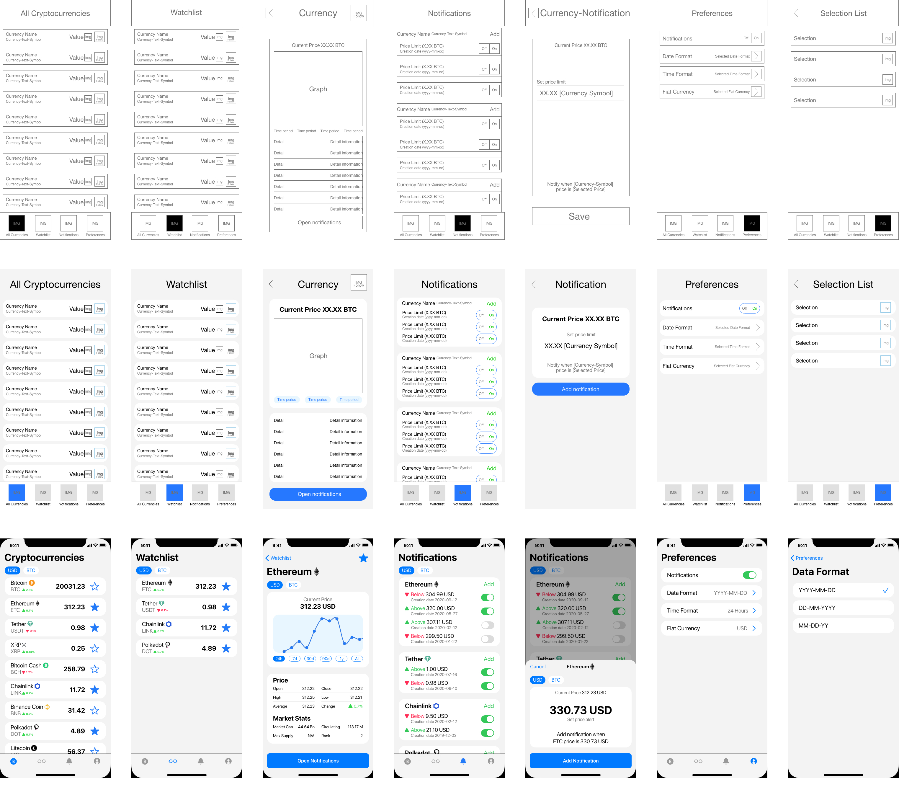
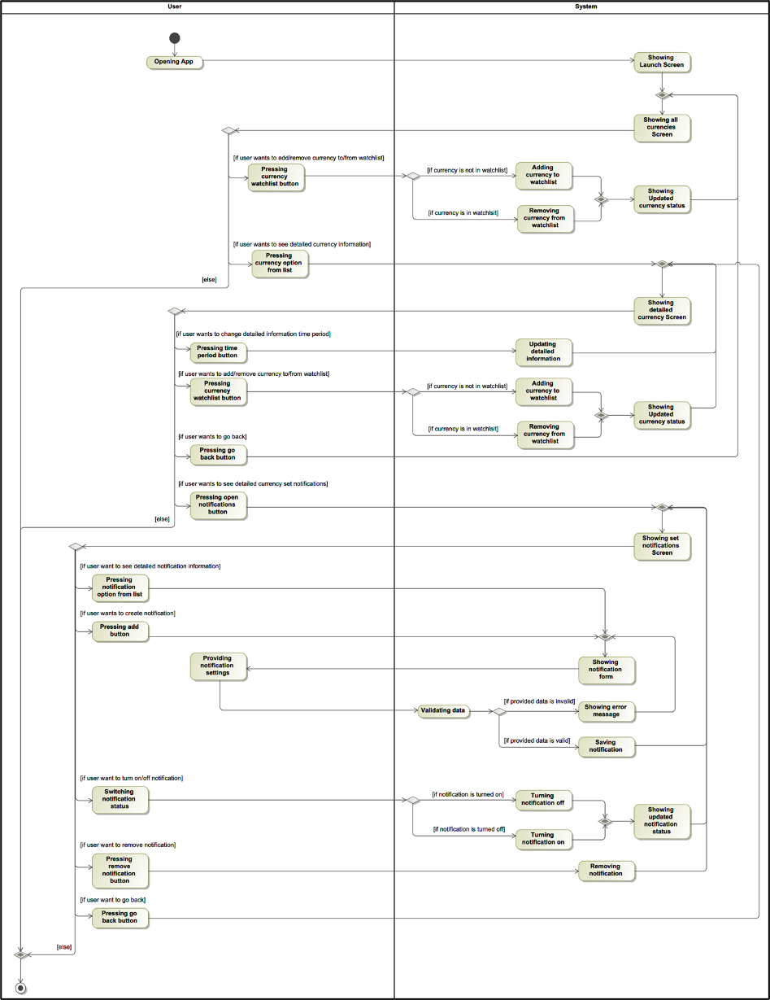
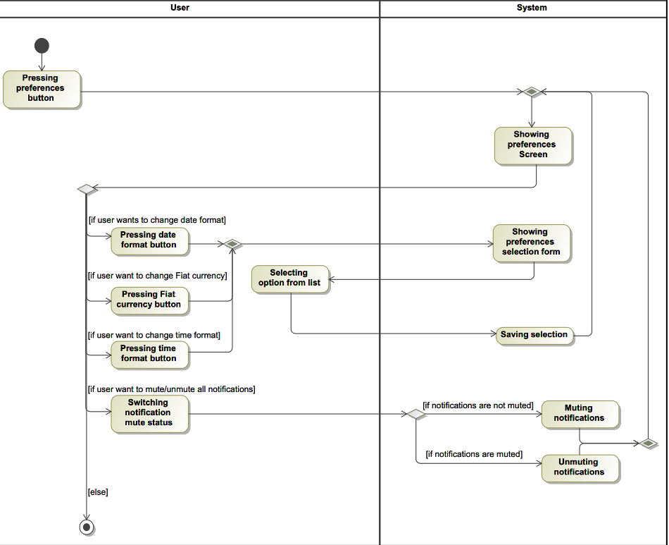

# CryptoChecker
iOS App for checking cryptocurrencies

## Current state of app

## Features
- [x] See cryptocurrencies
- [x] See cryptocurrency value changes
- [x] Save cryptocurrency to watchlist
- [x] See detailed information about cryptocurrency
- [x] Create cryptocurrency value change notification
- [x] Represent cryptocurrency value to Fiat value
- [ ] See cryptocurrency information in real time
- [ ] Get notified by created notifications
- [ ] Working graph representation of historical cryptocurrency data
- [ ] Real time and accurate cryptocurrency value convertion to Fiat value
- [ ] Cryptocurrency data fetching from API

## Initial design ideas

Created with Adobe XD

## UML Activity diagrams

## TODO List
- [ ] Add Core Data local database
- [ ] Fetch cryptocurrency data with API
- [ ] Implement notificaitons
